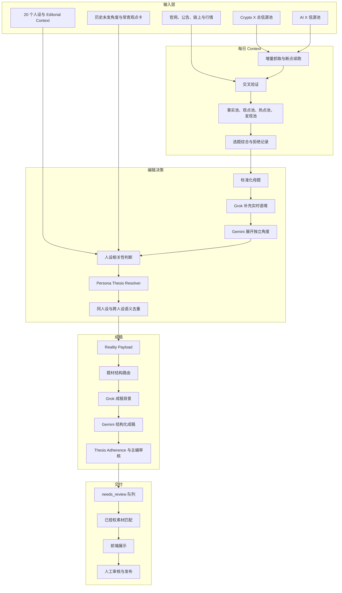
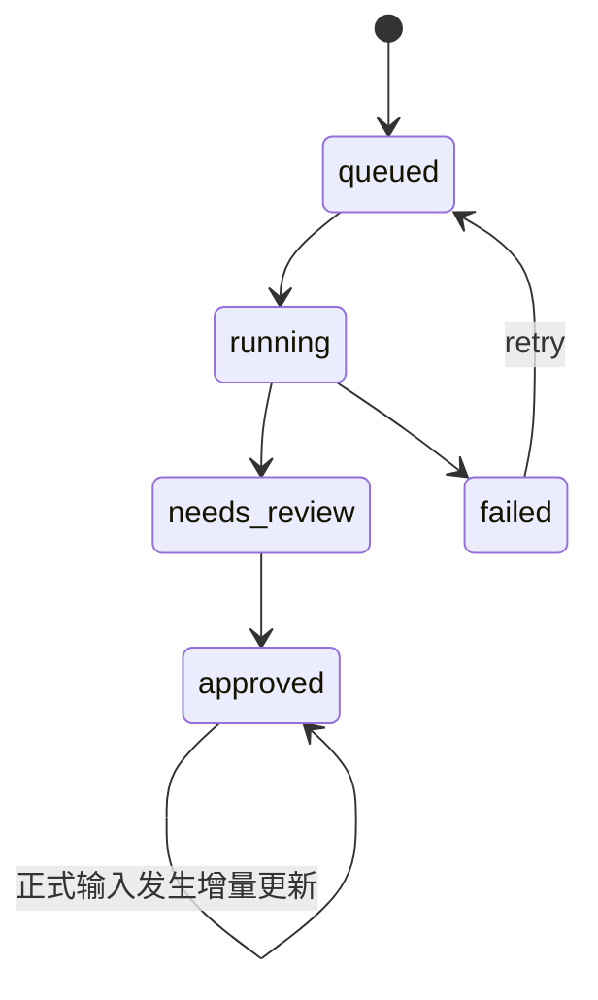
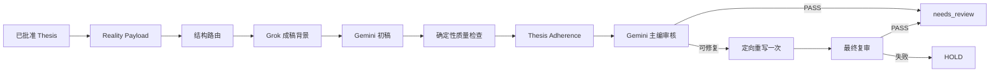

# 内容生产系统架构

本文描述 `x-account-operator` 当前生产实现。系统目标不是自动经营 X 账号，而是稳定地产出“有来源、有明确主张、符合人设、可人工审核”的中文推文候选。

## 1. 系统边界

系统负责：

- 从 Crypto 与 AI 的公开 X 信源池增量抓取内容；
- 整理事实、观点、热点、发现题和待研究问题；
- 为每个人设解析独立 Thesis；
- 补充实时语境、选择文章结构、生成并审核正文；
- 保存生成过程、历史主张、旧稿和待审队列；
- 在前端展示完整推文和已授权素材。

系统不负责：

- 登录或控制 X 账号；
- 自动点赞、转发、关注、排期或发布；
- 把二手观点自动认定为官方事实；
- 编造经历、持仓、价格、数据、引语或素材授权；
- 为满足数量目标而绕过 Thesis、事实或质量门槛。

## 2. 总体架构



## 3. 每日 Context 层

### 3.1 信源

两类信源独立抓取，但使用同一套数据契约：

- Crypto：`configs/content_source_accounts.json`；
- AI：`configs/ai_content_source_accounts.json`。

Twitter241 只读抓取公开时间线。抓取按账号保存水位，遇到早于水位的帖子停止翻页；失败账号有限重试，结果按 tweet id 去重。凭据只从运行环境或 Keychain 读取。

### 3.2 卡片与题池

抓取结果先进入 SQLite 来源库，再生成：

- `fact_cards`：可追溯的事实候选；
- `opinion_cards`：作者观点，不能写成事实；
- `attention_topics`：高讨论信号；
- `discussion_topics`：适合展开讨论的主题；
- `niche_topics` / `discovery_topics`：尚未成为大众热点，但已有多人、跨列表、多帖或互动信号的项目和趋势；
- `opportunity_questions`、`editorial_questions`、`research_questions`：不同内容目的的候选问题。

热点池与发现池都只是选题入口。是否能写，仍由 `configs/topic_selection_policy.json` 的增量价值、常识、重复、证据和读者价值门槛决定。

### 3.3 生命周期



定时抓取由 `XOPS_DAILY_CONTEXT_RUN_TIME` 控制。当前常驻 Post Scheduler 发现当天 Context 为 `needs_review` 时会调用批准逻辑，然后启动人设流水线；手动审核、重跑和批准接口仍然保留。

## 4. Topic、Angle 与 Thesis

这三层不能互相替代：

| 层 | 回答的问题 | 是否包含立场 |
| --- | --- | --- |
| Topic | 今天发生了什么，研究对象是什么 | 否 |
| Angle | 这件事有哪些互不替代的解释视角 | 是，但尚未绑定人设最终主张 |
| Thesis | 这个人对这个角度到底主张什么 | 是，且必须唯一明确 |

### 4.1 Angle Expansion

同一母题可以展开机会、行业评价、项目评价、市场认知、交易哲学、人物与社区等角度。角度不是栏目配额，也不按人设轮换。没有信息增量的母题可以返回零个角度。

合格 Angle 必须同时具备：

- 具体对象；
- 具体冲突；
- 可争论的结论；
- 相对已有内容的增量；
- 清晰的读者价值。

### 4.2 Persona Thesis Resolver

每个人设对候选题只能返回：

- `WRITE(ThesisContract)`：值得写且主张完整；
- `HOLD(reason)`：当前条件不够，保留审计；
- `IGNORE(reason)`：不属于该人设或没有价值。

`ThesisContract` 冻结以下内容：

- 具体对象和适用范围；
- 唯一核心主张；
- 人设观察位置；
- 证据边界；
- 读者收益与信息增量；
- 可以推翻该判断的条件。

Thesis 通过确定性校验后，系统按“核心主张”而不是事件名称去重。同一事件的不同结论可以共存；同一结论换人设或换措辞只保留最匹配者。

## 5. Reality Grounding

Reality Payload 是 Thesis 和正文之间的事实边界，负责区分：

- 已批准事实；
- 可用于背景但不能升级为事实的搜索信息；
- 作者观点；
- 系统推断；
- 未确认或冲突信息。

Grok 可以搜索并补充最新背景、争议和反方材料，但搜索结果不会自动变成正式事实。正文只有在材料已被批准或满足系统的明确证据契约时，才能使用确定语气。

`validate_editorial_grounding()` 会检查事实引用、推断语气、未经支持的确定性表达和 Grounding 契约版本。未通过的稿件不会进入候选队列。

## 6. 内容结构层

`configs/editorial_content_structures.json` 是题材结构的硬配置。它只约束 HOW：

- 必需语义槽；
- 允许的论证顺序；
- Hook 选择；
- CTA 策略；
- 是否要求行动条件；
- 应避免的写法。

当前结构包括：资讯解释、配套讲解、开源项目发现、参与机会、交易机会、项目与产品评价、行业结构分析、市场认知、交易哲学与财富观、人物社区与乐子。

结构不能改变 Thesis，也不能因为人设不同而改变题材的论证骨架。人设差异来自观察位置、取舍、知识边界和语言习惯。

## 7. 生成与审核



模型或网络失败与内容质量失败分开处理：

- 提供方错误按 `generation_attempts`、`next_retry_at` 和 `generation_stage` 恢复；
- 内容问题最多定向重写一次；
- 每个阶段的输入、输出和审核结果保存在 `generation_state`，服务重启后可以继续；
- 失败不会用低质量占位稿补齐数量。

Grok、Gemini 人设判断和 Gemini 成稿分别有独立并发上限。Gemini 多 Key 池中的每把 Key 同时只承担一个请求。

## 8. 队列与历史

每个人设每天默认目标为 3 条。系统优先使用当天热点、发现题、已批准历史角度和人设私有成熟表达；不足时才从可审计常青卡补位。所有补位题仍走完整 Thesis、Grounding、结构和审核链路。

`GET /api/daily-posts` 在当天存在已批准 Context 且至少有一条合格 `needs_review` 候选时返回当前队列，不会等待所有 20 人全部达到 3 条。

候选状态：

- `needs_review`：前端可见，等待人工处理；
- `published`：人工确认已发布；
- `superseded`：被重批 Context 或批量重新生成替代的旧稿；
- `queued`：兼容历史数据的排队状态。

`POST /api/daily-posts/regenerate` 不删除旧稿。它把当前未发布候选标记为 `superseded`，增加 Context revision，再按新输入生成。

## 9. 数据模型

| 表 | 职责 |
| --- | --- |
| `daily_context_runs` | 每日抓取、综合、审核状态和正式输入版本 |
| `daily_market_contexts` | 已批准的公共市场 Context |
| `personas` | 人设定义与当前版本 |
| `persona_editorial_contexts` | 每个人设的草稿、批准版和 revision |
| `persona_contexts` | 受众、历史观点、关注项与禁区 |
| `persona_editorial_evaluations` | WRITE/HOLD/IGNORE、Thesis、审核和生成断点 |
| `post_candidates` | 完整正文、素材、状态和审计信息 |
| `topic_claim_history` | 已表达核心主张及去重状态 |
| `context_packs` | 人设专题 Context 包 |

生产 SQLite 位于 Railway `/data/xops.db`，来源帖子库位于同一持久卷。历史状态采用软替代，不通过批量重生成物理删除正文。

## 10. 前端与人工操作

- `/market`：查看每日 Context、来源覆盖、选题、拒绝原因并执行重跑或批准；
- `/personas`：维护人设、Editorial Context 和素材；
- `/`：按人设展示当天完整推文队列，支持单条重写和发布确认。

只有当前人设已批准的素材可以进入其候选稿。素材不是事实来源，也不能证明第一人称经历。

## 11. 安全与权限

- Twitter241 只读；
- 凭据不写入数据库、日志、生成文件或 Git；
- `XOPS_OPERATOR_TOKEN` 可保护全部写接口；
- 前端只在当前浏览器标签页的 session storage 保存 Operator Token；
- 服务不持有 X 发布授权；
- 发布动作仍由人工在外部完成。

## 12. 部署与恢复

服务使用 FastAPI、Uvicorn 和 SQLite，部署在 Railway：

```text
Railway Service
├── uvicorn app:app
├── /health
├── /data/xops.db
├── /data/market_source_posts.sqlite3
└── /data/daily_context_artifacts/
```

启动时会初始化缺失表、恢复当天中断的 Context 和生成状态。定时器每 30 秒检查一次是否需要启动当天 Context 或补齐待审稿；同一个 run 只允许一个常驻生成任务。

部署后检查：

1. `/health` 返回正确的契约版本、并发数和 Key 池槽位；
2. `/market` 能读取当天 Context；
3. `/api/daily-posts` 只返回完整 `needs_review` 推文；
4. 重启后 `/data` 中的历史、旧稿和断点仍然存在；
5. 写接口在配置 Token 时拒绝未授权请求。
