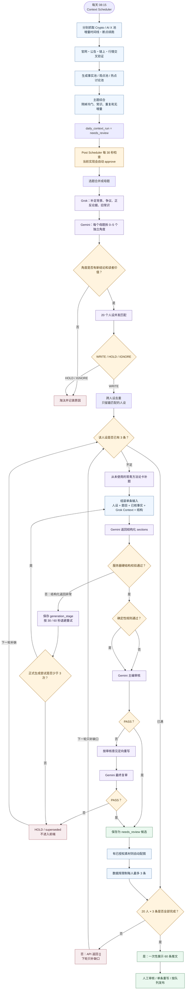

# 每日内容生产流程

从定时抓取到前端整批展示的真实执行流程；黄色节点是门槛，红色节点不会进入前端。

```mermaid
flowchart TD
    START(["每天 08:15<br/>Context Scheduler"])
    FETCH["分别抓取 Crypto / AI X 池<br/>增量时间线・断点续跑"]
    VERIFY["官网・公告・链上・行情交叉验证"]
    CARDS["生成事实池 / 观点池 / 热点讨论池"]
    SELECT["主题综合<br/>筛掉冷门、常识、重复和无增量"]
    REVIEW["daily_context_run = needs_review"]
    AUTO["Post Scheduler 每 30 秒检查<br/>当前实现会自动 approve"]
    MOTHER["选题合并成母题"]
    GROK["Grok：补足背景、争议、正反论据、旧常识"]
    ANGLE["Gemini：每个母题拆 0–5 个独立角度"]
    ANGLEGATE{"角度是否有新结论和读者价值？"}
    REJECTTOPIC["淘汰并记录原因"]
    PERSONA["20 个人设并发匹配"]
    DECISION{"WRITE / HOLD / IGNORE"}
    COLLISION["跨人设去重<br/>只留最匹配的人设"]
    FLOOR{"该人设是否已有 3 条？"}
    SUPPLEMENT["从未使用的常青方法论卡补题"]
    INPUT["组装单条输入<br/>人设 + 题目 + 已核事实 + Grok Context + 结构"]
    WRITE["Gemini 返回结构化 sections"]
    HARD{"服务器硬结构校验通过？"}
    DET{"确定性规则通过？"}
    CRITIC["Gemini 主编审核"]
    PASS{"PASS？"}
    REWRITE["按审核意见定向重写"]
    FINAL["Gemini 最终复审"]
    FINALPASS{"PASS？"}
    RETRY["保存 generation_stage<br/>按 30 / 60 秒退避重试"]
    RETRYGATE{"正式生成尝试是否少于 3 次？"}
    HOLD["HOLD / superseded<br/>不进入前端"]
    CANDIDATE["保存为 needs_review 候选"]
    ASSET["有已授权素材则自动配图"]
    CAP["数据库限制每人最多 3 条"]
    BATCH{"20 人 × 3 条是否全部完成？"}
    EMPTY["否：API 返回 []<br/>下轮只补缺口"]
    FRONT["是：一次性展示 60 条推文"]
    MANUAL["人工审核 / 单条重写 / 按队列发布"]

    START --> FETCH --> VERIFY --> CARDS --> SELECT --> REVIEW --> AUTO
    AUTO --> MOTHER --> GROK --> ANGLE --> ANGLEGATE
    ANGLEGATE -->|否| REJECTTOPIC
    ANGLEGATE -->|是| PERSONA --> DECISION
    DECISION -->|HOLD / IGNORE| REJECTTOPIC
    DECISION -->|WRITE| COLLISION --> FLOOR
    FLOOR -->|不足| SUPPLEMENT --> INPUT
    FLOOR -->|已满| BATCH
    INPUT --> WRITE --> HARD
    HARD -->|否：结构化返回异常| RETRY
    HARD -->|是| DET
    DET -->|否| CRITIC
    DET -->|是| CRITIC
    CRITIC --> PASS
    PASS -->|是| CANDIDATE
    PASS -->|否| REWRITE --> FINAL --> FINALPASS
    FINALPASS -->|否| HOLD
    FINALPASS -->|是| CANDIDATE
    RETRY --> RETRYGATE
    RETRYGATE -->|是| INPUT
    RETRYGATE -->|否| HOLD
    HOLD -->|下一轮补缺| FLOOR
    CANDIDATE --> ASSET --> CAP --> BATCH
    BATCH -->|否| EMPTY -->|下一轮只补缺口| FLOOR
    BATCH -->|是| FRONT --> MANUAL

    classDef data fill:#eef6ff,stroke:#4776a8,color:#17293c;
    classDef model fill:#f4f0ff,stroke:#7259a8,color:#281d40;
    classDef gate fill:#fff4df,stroke:#a66b18,color:#4d3108;
    classDef reject fill:#f7ecee,stroke:#9a4b56,color:#481f28;
    classDef success fill:#eaf8ef,stroke:#3b7d52,color:#173b23;
    class FETCH,VERIFY,CARDS,SELECT,INPUT,ASSET,CAP data;
    class GROK,ANGLE,PERSONA,WRITE,CRITIC,REWRITE,FINAL,SUPPLEMENT,RETRY model;
    class ANGLEGATE,DECISION,FLOOR,HARD,DET,PASS,FINALPASS,RETRYGATE,BATCH,AUTO gate;
    class REJECTTOPIC,HOLD,EMPTY reject;
    class CANDIDATE,FRONT,MANUAL success;
```
