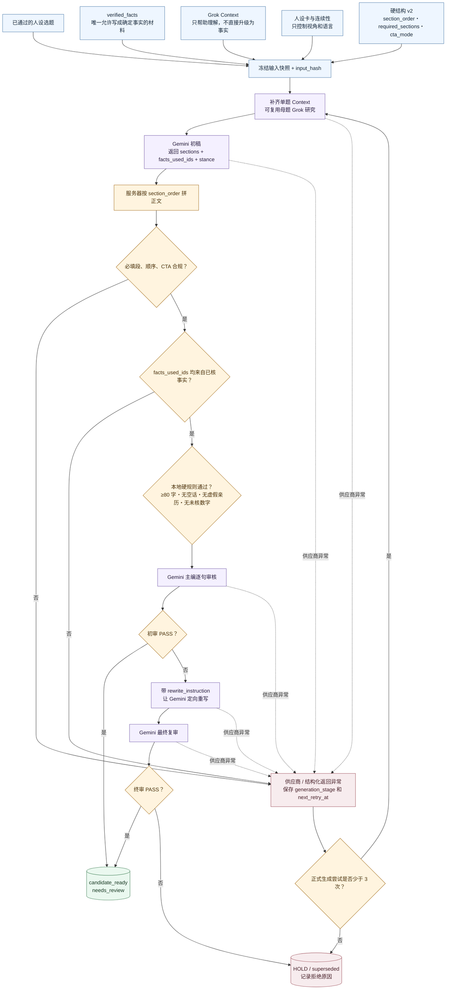

# 单条 Post 生成与淘汰循环

单条内容从冻结输入到最终候选的全过程；模型输出不能直接进入前端，必须经过服务器硬结构、本地确定性规则和 Gemini 主编审核。

```mermaid
flowchart TD
    T["已通过的人设选题"]
    F["verified_facts<br/>唯一允许写成确定事实的材料"]
    X["Grok Context<br/>只帮助理解，不直接升级为事实"]
    P["人设卡与连续性<br/>只控制视角和语言"]
    S["硬结构 v2<br/>section_order・required_sections・cta_mode"]
    INPUT["冻结输入快照 + input_hash"]
    CONTEXT["补齐单题 Context<br/>可复用母题 Grok 研究"]
    DRAFT["Gemini 初稿<br/>返回 sections + facts_used_ids + stance"]
    ASSEMBLE["服务器按 section_order 拼正文"]
    STRUCT{"必填段、顺序、CTA 合规？"}
    FACT{"facts_used_ids 均来自已核事实？"}
    LOCAL{"本地硬规则通过？<br/>≥80 字・无空话・无虚假亲历・无未核数字"}
    CRITIC["Gemini 主编逐句审核"]
    PASS{"初审 PASS？"}
    REWRITE["带 rewrite_instruction<br/>让 Gemini 定向重写"]
    FINAL["Gemini 最终复审"]
    FINALPASS{"终审 PASS？"}
    READY[("candidate_ready<br/>needs_review")]
    HOLD[("HOLD / superseded<br/>记录拒绝原因")]
    RETRY["供应商 / 结构化返回异常<br/>保存 generation_stage 和 next_retry_at"]
    RETRYGATE{"正式生成尝试是否少于 3 次？"}

    T --> INPUT
    F --> INPUT
    X --> INPUT
    P --> INPUT
    S --> INPUT
    INPUT --> CONTEXT --> DRAFT --> ASSEMBLE --> STRUCT
    STRUCT -->|否| RETRY
    STRUCT -->|是| FACT
    FACT -->|否| RETRY
    FACT -->|是| LOCAL --> CRITIC --> PASS
    PASS -->|是| READY
    PASS -->|否| REWRITE --> FINAL --> FINALPASS
    FINALPASS -->|是| READY
    FINALPASS -->|否| HOLD
    RETRY --> RETRYGATE
    RETRYGATE -->|是| CONTEXT
    RETRYGATE -->|否| HOLD
    CONTEXT -.供应商异常.-> RETRY
    DRAFT -.供应商异常.-> RETRY
    CRITIC -.供应商异常.-> RETRY
    REWRITE -.供应商异常.-> RETRY
    FINAL -.供应商异常.-> RETRY

    classDef input fill:#eef6ff,stroke:#4776a8,color:#17293c;
    classDef model fill:#f4f0ff,stroke:#7259a8,color:#281d40;
    classDef gate fill:#fff4df,stroke:#a66b18,color:#4d3108;
    classDef success fill:#eaf8ef,stroke:#3b7d52,color:#173b23;
    classDef reject fill:#f7ecee,stroke:#9a4b56,color:#481f28;
    class T,F,X,P,S,INPUT input;
    class CONTEXT,DRAFT,CRITIC,REWRITE,FINAL model;
    class ASSEMBLE,STRUCT,FACT,LOCAL,PASS,FINALPASS,RETRYGATE gate;
    class READY success;
    class HOLD,RETRY reject;
```
